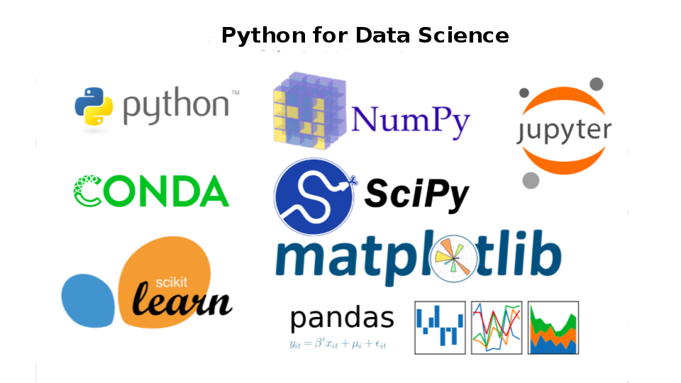

## Quick Start

The workshop code is available as [Jupyter notebooks](https://github.com/aymanibrahim/pyds/tree/master/notebooks). You can run the notebooks in the cloud (no installation required) by clicking the "launch binder" button:

[](https://mybinder.org/v2/gh/aymanibrahim/pyds/master)

# Why
For people who struggle to start in data science with Python

# Description
This hands-on in-person workshop is based on 
[Python for Data Science Course by IBM Cognitive Class](https://cognitiveclass.ai/courses/python-for-data-science/)

Learn how to create your first Python scripts
and perform basic hands-on data analysis using Jupyter-based environment.


# [Outline](https://github.com/aymanibrahim/pyds/blob/master/notebooks/00_Outline.ipynb) 
The workshop will cover core topics:

## [01 Basics](https://github.com/aymanibrahim/pyds/blob/master/notebooks/01_Basics.ipynb) [](https://colab.research.google.com/github/aymanibrahim/pyds/blob/master/notebooks/01_Basics.ipynb)
- Hello World
- Comments
- Errors
- Types
- Expressions
- Variables
- Strings

## [02 Data Structures](https://github.com/aymanibrahim/pyds/blob/master/notebooks/02_Data_Structures.ipynb) [](https://colab.research.google.com/github/aymanibrahim/pyds/blob/master/notebooks/02_Data_Structures.ipynb)
- Tuples
- Lists
- Sets
- Dictionaries

## [03 Fundamentals](https://github.com/aymanibrahim/pyds/blob/master/notebooks/03_Fundamentals.ipynb) [](https://colab.research.google.com/github/aymanibrahim/pyds/blob/master/notebooks/03_Fundamentals.ipynb)
- Conditions 
- Branching
- Loops
- Functions
- Objects 
- Classes

## [04 Working with Data](https://github.com/aymanibrahim/pyds/blob/master/notebooks/04_Working_with_Data.ipynb) [](https://colab.research.google.com/github/aymanibrahim/pyds/blob/master/notebooks/04_Working_with_Data.ipynb)
- Reading files with open
- Writing files with open
- Loading data with pandas
- Working with and Saving data with pandas

## [05 Arrays](https://github.com/aymanibrahim/pyds/blob/master/notebooks/05_Arrays.ipynb) [](https://colab.research.google.com/github/aymanibrahim/pyds/blob/master/notebooks/05_Arrays.ipynb)
- Creating and Manipulating 1D & 2D Arrays
- Array Operations

# Pre-workshop 

You will need a laptop that can access the internet 

## 1: Installation
Install miniconda or install the (larger) Anaconda distribution

[Install Python 3.7 using Miniconda](https://conda.io/projects/conda/en/latest/user-guide/install/index.html)

OR [Install Python 3.7 using Ananconda](https://www.anaconda.com/distribution/)

## 2: Setup

### 2.1: Download workshop code & materials
Clone the repository
```
git clone git@github.com:aymanibrahim/pyds.git
```
OR [Download the repository as a .zip file](https://github.com/aymanibrahim/pyds/archive/master.zip)

### 2.2: Change directory to pyds
Change current directory to **pyds** directory
```
cd pyds
```
### 2.3: Install Python with required packages
Install Python 3.7 with the required packages into an environment named _pyds_  as per [environment.yml](https://github.com/aymanibrahim/pyds/blob/master/environment.yml) YAML file.
```
conda env create -f environment.yml
```
When conda asks if you want to proceed, type "y" and press Enter.

## 3: Activate environment
Change the current default environment (_base_) into _pyds_ environment.
```
conda activate pyds
```
## 4: Check installation
Use [check_environment.py](https://github.com/aymanibrahim/pyds/blob/master/check_environment.py) script to make sure everything was installed correctly, open a terminal, and change its directory (cd) so that your working directory is the workshop directory _pyds_ you cloned or downloaded. Then enter the following:
```
python check_environment.py
```
If everything is OK, you will get the following message:
> Your workshop environment is set up

## 5: Start JupyterLab
Start JupyterLab using:
```
jupyter lab
```
JupyterLab will open automatically in your browser.

You may access JupyterLab by entering the notebook server’s URL into the browser.

## 6: Stop JupyterLab
Press **CTRL + C** in the terminal to stop JupyterLab.

## 7: Deactivate environment
Change the current environment (_pyds_) into the previous environment.
```
conda deactivate
```

# Workshop Instructor
## Ayman Ibrahim, PMP

- [LinkedIn](https://www.linkedin.com/in/aymanibrahim/)
- [Kaggle](https://www.kaggle.com/aymani)
- [GitHub](https://github.com/aymanibrahim)
- [Twitter](https://twitter.com/AymanIbrahim)
- [Facebook](https://www.facebook.com/ayman.ibrahim.awad)

# References
- [Python: Programming language](https://www.python.org)
- [Conda: Package and environment manager](https://conda.io/en/latest/)
- [Anaconda: Python distribution](https://www.anaconda.com/distribution/)
- [Miniconda: Minimal installer for conda](https://conda.io/en/latest/miniconda.html)
- [NumPy: Fundamental package for scientific computing with Python](https://numpy.org)
- [Matplotlib: Python 2D plotting library](https://matplotlib.org)
- [pandas: Python data analysis library](https://pandas.pydata.org)
- [Jupyter Notebook: Web application to create documents with code, equations, visualizations and text](https://jupyter.org/)
- [JupyterLab: Web-based development environment for Jupyter Notebooks](https://jupyter.org/)
- [Python for Data Science: Course by IBM Cognitive Class](https://cognitiveclass.ai/courses/python-for-data-science/)

# Contributing
Thanks for your interest in contributing! There are many ways to contribute to this project. Get started [here](https://github.com/aymanibrahim/pyds/blob/master/CONTRIBUTING.md).

# License

## Workshop Code
[](https://opensource.org/licenses/MIT)

## Workshop Materials

<a rel="license" href="http://creativecommons.org/licenses/by/4.0/"></a>

<span xmlns:dct="http://purl.org/dc/terms/" property="dct:title">*Python for Data Science Workshop*</span> by <a xmlns:cc="http://creativecommons.org/ns#" href="https://github.com/aymanibrahim" property="cc:attributionName" rel="cc:attributionURL">Ayman Ibrahim</a> is licensed under a <a rel="license" href="http://creativecommons.org/licenses/by/4.0/">Creative Commons Attribution 4.0 International License</a>.  Based on a work at <a xmlns:dct="http://purl.org/dc/terms/" href="https://cognitiveclass.ai/courses/python-for-data-science/" rel="dct:source">IBM Cognitive Class Python for Data Science</a> by <a href="https://www.linkedin.com/in/joseph-s-50398b136/"> Joseph Santarcangelo, PhD.</a>